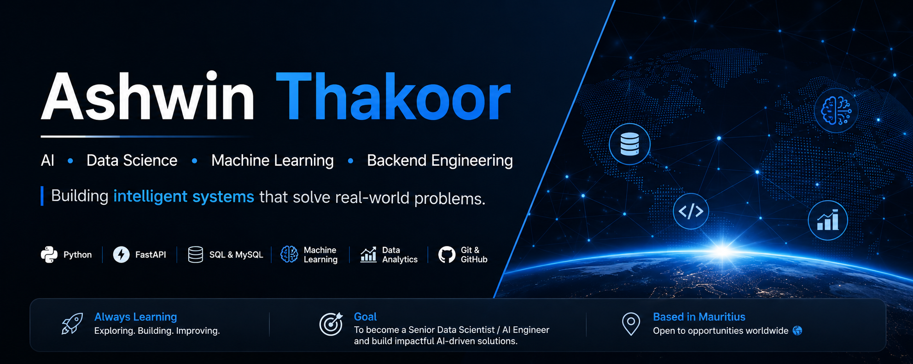

  

# Ashwin Thakoor

### AI, Data & Backend Development | Python • SQL • FastAPI

I build practical systems across **machine learning, data and Python backend engineering**. My background combines enterprise application support and SQL/log-based troubleshooting with independent projects that integrate APIs, data processing, ML workflows, testing and user-facing applications.

📍 Mauritius · Open to international relocation & remote opportunities

## Featured engineering work

### [NEXORA AI](https://github.com/AshwinThakoor/nexora-portfolio)
**Python · FastAPI · LightGBM · MetaTrader 5 · Pandas · NumPy · Docker/WSL**

Independent ML-assisted trading research system connecting market/candle data, directional-model research, confidence analysis, a FastAPI signal architecture, independent risk controls, MT5 integration and post-decision analytics.

**Inspect the evidence:** [Trading Engine](https://github.com/AshwinThakoor/nexora-trading-engine) for ML/trading/backend analytics and [NEXORA Brain](https://github.com/AshwinThakoor/nexora-brain) for deeper FastAPI, SQLAlchemy, migrations, ingestion and document-processing infrastructure.

> Active R&D. I do not claim guaranteed profitability or publish the private strategy, trained model artifacts, raw datasets, credentials or tuned execution parameters.

### [JobHunt MU](https://github.com/AshwinThakoor/jobhunt-mu)
**Python · Django · SQLite · Stripe · Data Processing · Testing · CI**

Recruitment/job-discovery platform built around normalized multi-source opportunity data, candidate workflows, resume analysis, explainable matching architecture, application preparation and Stripe payments.

At a verified development milestone, the private aggregation pipeline worked with **MyJob.mu, Jobs.mu, Mauritius Jobs and Remotive** and produced **60+ live listings**. The public repository exposes recruiter-safe Django code, CV-analysis examples, payment/test evidence, CI and architecture documentation while keeping source-specific adapters and commercially useful recommendation logic private.

## Skills backed by visible projects

| Skill area | Public evidence |
|---|---|
| **Python** | NEXORA Trading Engine, NEXORA Brain, JobHunt MU |
| **FastAPI / REST architecture** | NEXORA Trading Engine architecture + NEXORA Brain implementation |
| **Django** | JobHunt MU application, models, views and tests |
| **Machine learning / LightGBM** | NEXORA trading research and evaluation workflows |
| **Pandas / NumPy / data analysis** | NEXORA analytics and evaluation modules |
| **SQL/data modeling** | NEXORA Brain SQLAlchemy/Alembic schema + JobHunt relational models; professional SQL troubleshooting experience is described on my resume |
| **Document processing** | NEXORA Brain parsers/chunking + JobHunt CV analysis |
| **Testing / CI** | NEXORA Brain pytest suite + JobHunt regression tests/GitHub Actions |
| **Docker / engineering workflow** | JobHunt container configuration and NEXORA development documentation |
| **Stripe integration** | JobHunt payment workflow and tests |

## Professional background

I have enterprise application-support experience investigating incidents through **SQL-based root-cause analysis, application logs, API/testing tools and structured troubleshooting** in an SLA-driven environment. I use that production-support mindset in my engineering projects: make behavior observable, document assumptions, test important paths and fail safely.

Employer systems, customer information, internal code and confidential work artifacts are **not** published on GitHub.

## Technical toolkit

**Core:** Python · SQL · Pandas · NumPy · Data Cleaning · EDA · Feature Engineering  
**ML / AI:** Scikit-learn · LightGBM · predictive modeling · time-series analysis · LLM/AI infrastructure learning  
**Backend:** FastAPI · Django · REST APIs · SQLAlchemy · Alembic · API Integration  
**Databases / Analytics:** MySQL · SQL Server · SQLite · Power BI · Plotly · Matplotlib  
**Engineering:** Git · GitHub · Docker · Postman · VS Code · Cursor

Some technologies in my broader toolkit come from coursework, certification work or private/professional experience and therefore may not have a dedicated public repository. The projects above are the primary source of public engineering evidence.

## Current focus

I’m deepening my work in **applied machine learning, data engineering, LLM/retrieval systems, MLOps/cloud deployment and scalable Python backend architecture** while continuing to strengthen the measurable evidence, testing and documentation behind my existing projects.

## Portfolio principles

- Show inspectable engineering rather than inflated claims.
- Separate implemented features from roadmap ideas.
- Keep credentials, personal data, employer information and proprietary implementation private.
- Document architecture and testing so a reviewer can understand a project quickly.
- Treat AI-assisted development as a tool; understand and defend the code and design decisions presented here.

## Connect

[LinkedIn](https://www.linkedin.com/in/ashwin-thakoor-7aa2a3373) · [GitHub](https://github.com/AshwinThakoor)

---

> Public project repositories are curated portfolio showcases. Sensitive credentials, private datasets, proprietary implementation details and commercially valuable logic are intentionally kept private.
